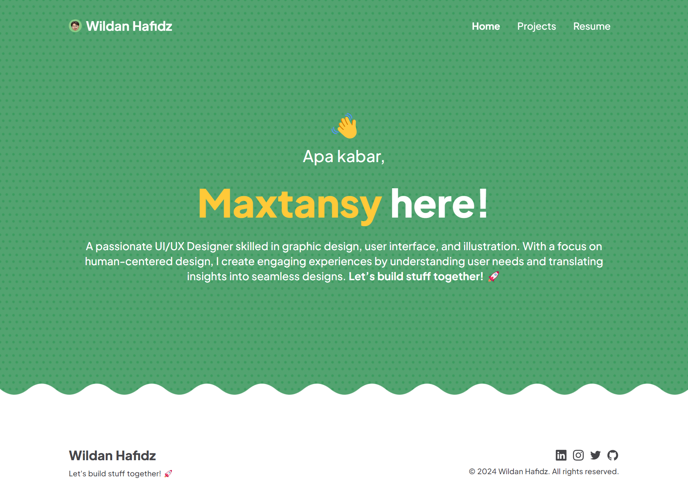

new [nikoshaa](https://nikoshaa.github.io/) website built with Nuxt.js, React Three Fibre, and Tailwind with Twin Macro

Quick start

Navigate into your new site’s directory and start it up.

```bash
# install dependencies
$ yarn install
```
```bash
# serve with hot reload at localhost:3000
$ yarn dev
```
```bash
# build for production and launch server
$ yarn build
$ yarn start
```
```bash
# generate static project
$ yarn generate
```

For detailed explanation on how things work, check out [Nuxt.js docs](https://nuxtjs.org).
